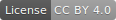

# Blog

Have a peek »»» [https://www.attejuvonen.fi](https://www.attejuvonen.fi)

## Features

- **Responsive** and streamlined design.
- GatsbyJS compiles the blog into HTML+CSS+JS so **hosting the blog costs nothing** at providers like Netlify.
- **Blazing fast** UX: The website is visible and functional after only 1 round trip and ~20kB of data. That first round trip can be super fast to anywhere in the world, because the blog is only static assets which can be delivered by CDN. Subsequent pageloads render ~instantly thanks to link prefetching.
- Autogenerated **tracedSVG image placeholders** are stylized to create a smooth look and transition as the image loads without the page jumping around.
- Write blog posts into **Markdown** files (easy to format and content will not be married to any platform).
- **Expandable**: possible to embed custom React components into Markdown.
- Posts organized by **tags**.
- **Teasers** of posts are generated to front page with **infinite scroll** which gracefully degrades into **pagination**.
- Allow readers to be notified of updates with **RSS feed** and email newsletter.
- Contact Form.

## Feel free to fork

You are free to use this repo to create your own blog (code is MIT licensed). You may also use the written content in this blog however you like, provided that you [give appropriate credit](https://creativecommons.org/licenses/by/4.0) (CC BY 4.0).

#### How to create your own blog with this repo

- Basic setup
    - Prerequisites: learn about ReactJS and GatsbyJS.
    - Recommended: Use `nvm` to switch between Node versions. This project is confirmed to work with v12.16.3.
    - Fork and `npm install`.
    - Run in development mode with `gatsby develop`. First run will take several minutes, but subsequent runs will be faster.
    - Run in production mode with `gatsby build && gatsby serve` (or `./fastbuild.sh`). If you want to delete `cache` and `public` before building, use `./slowbuild.sh` (recommended for releases to avoid leaking development data). You may have to make the scripts executable before you are able to run them (`chmod +x filename`).
- Make it your own
    - Go through everything in `content/meta/config.js` and `content/pages` and `content/parts`
    - Search all files for "atte".
    - Replace `static/preview.jpg` (this is the image that is used when someone shares a link to your blog on a social network like Reddit). Recommended aspect ratio is 1.91.
    - When you publish, make sure caching and redirects work reasonably. I recommend Netlify, in which case cache configuration in `static/_headers` is fine and you just need to edit 1 line in `static/_redirects`.
    - Move your own icons into `src/images/app-icons`, run `npm run generate-app-icons`, then replace `static/favicon.ico`.
    - Environment variables can be set in a `.env` file. It's good practice to keep it in `.gitignore` so it doesn't get published to the repo. When you publish your website, find out how you can add environment variables to your host without publishing the `.env` file. If you are wondering why environment variables are used, it is to prevent people from accidentally spamming (for example, people who forked this repo used to test the contact page by sending me messages like dffdsffdsfd).
    - There is an e-mail newsletter link on the `Subscribe` page. Remove it or set up a newsletter and add the URL as an environment variable `EMAIL_SUB_LINK`.
    - There is a Contact page. Remove it or set up handling for your form submissions. The POST address where forms are sent is defined in environment variable `CONTACT_POST_ADDRESS`. I'm using Google Script to handle form submissions. If you also want to use Google Script, [instructions are here](https://github.com/dwyl/learn-to-send-email-via-google-script-html-no-server) and [here is an improved version of the script](handleFormSubmission.gs). 
    - [OPTIONAL] If you want a "Hero" section at the top of the home page, just set `hero.hide` to `false` in `theme.yaml`.
    - [OPTIONAL] If you want [Plausible Analytics](https://plausible.io/): add `PLAUSIBLE_DOMAIN=mywebsite.com` to environment variables.
- Creating content
    - Blog posts are in `mock_posts` and `posts` folders. By default only mock posts are used (to help you tweak the website before you have a lot of content). You can switch to real posts by creating an environment variable `POSTS_FOLDER=posts`. Please try not to accidentally repost my real posts if you are only tinkering.
    - When you create posts, a folder with a name like `2020-03-05--my-book-review` will be published, whereas a name like `my-book-review` will be considered a draft and will not be published. There are ways to accidentally publish drafts. If you are worried about that, the easiest way to avoid it is to deploy your site from GitHub via Netlify and _never commit draft posts to the repo_.
    - You have to manually crop images to 2.222 aspect ratio.

## Attribution

Hi, I'm Baobab. I didn't do everything by myself; I leveraged the work of many awesome creators.

- Photos are mostly from [Unsplash](https://www.unsplash.com/), hover over to see photographer attribution.
- Icons are mostly from [FontAwesome](https://origin.fontawesome.com/).

I started building on top of [Greg Lobinski's](https://github.com/greglobinski) excellent [hero-blog-starter](https://github.com/greglobinski/gatsby-starter-hero-blog/). Main changes from Greg's version:

- Fixed draft posts (used to leak draft posts into production)
- Fixed RSS feed
    - Dates were added to RSS items so that RSS readers are able to tell which content is new.
    - Non-post pages removed from RSS feed.
- Fixed 404 page (text used to be hidden under header)
- Contact page entirely redone.
    - Had a font issue caused by antd library. I was unable to reproduce the issue locally to find what was causing it, so I redid the entire form without the library.
    - Submission used to require entire web site to be hosted on Netlify. Now the Contact Form submission uses Google Scripts and web site hosting / form handling can be changed independently.
    - Submission works for users who have JS disabled.
- Allow multiple tags (used to be just 1 category per post)
- Allow custom React components inside Markdown files.
- Added 'Subscribe' page, so users know that RSS feed exists (the page also contains a link to email newsletter)
- Added infinite scroll, which gracefully degrades into pagination.
- Many design changes. Spent a lot of time tweaking image placeholders :gem: Removed and simplified a lot of features to create a less cluttered look (matter of preference, eye of the beholder and so forth...)

